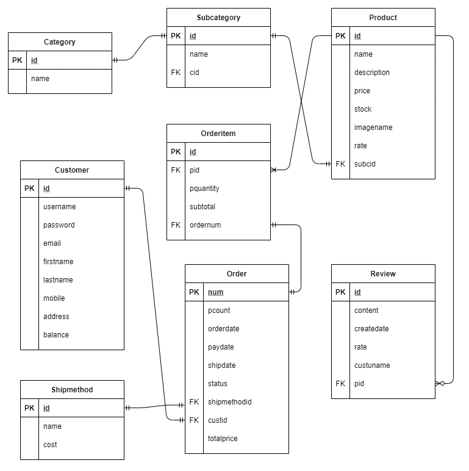

# Webshop

A webshop created with Java, Servlet, Oracle database, Bootstrap.

## Setup

### Prerequisities

- Oracle database
- Tomcat server

### Run it locally

1. `git clone https://github.com/zhouppei/Webshop.git`
2. import project to IntelliJ (or to other IDE)
3. change database configurations to own
4. run Tomcat Server
5. open browser and go to localhost:8081 (change the port 8081 to which is defined in Tomcat server config)

### Configuration

- change database config in [DatabaseUtil.java](./src/main/java/util/DatabaseUtil.java)
    - `loginname` (database user's name), `password` (database user's password)

    - create database based on the entity relationship diagram

      

- setup Tomcat server in IntelliJ
    1. `Run` -> `Edit Configurations...`
    2. on top left corner click on `+` button
    3. select `Tomcat Server` `Local`
    4. under `Server` tab at `Application server` choose the downloaded Tomcat server
    5. under `Deployment` click on the `+` button located at bottom left of the `Deploy at the server startup` block -> click on `Artifact...` -> change `Application context` value to `/`


## File structure

```
src/main/java
   |-- DAO                          - Data Access Object (get data from the database)
   |-- bean                         - database entities
   |-- filter                       - filter the request
   |   |-- BackServletFilter.java   - run the correspond Servlet and method (CRUD operations with database)
   |   |-- ForeServletFilter.java   - run ForeServlet and method
   |-- servlet                      - process the request
   |-- util
   |   |-- DatabaseUtil.java        - util for create connection with the Oracle database
web
   |-- WEB-INF
   |   |-- lib                      - contains jar files (e.g. ojdbc6.jar library for create connection with Oracle database)
   |   |-- web.xml
   |-- *.jsp                        - JavaServer Pages, create dynamically generated web pages
   |-- css                          - style files
   |-- fonts	
   |-- image				
   |-- include                      - contains JavaServer Pages which is reusable (header, footer)
   |-- js                           - javascript files
```


